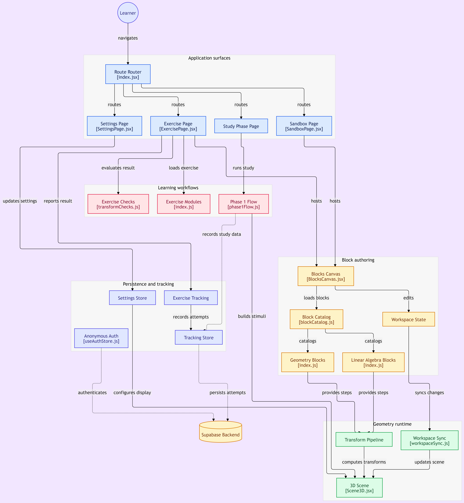

# GEOSCRATCH
## ⭐Overview
GeoScratch is a block-based visual programming tool for learning 3D geometry and linear algebra. It pairs Blockly's drag-and-drop editor with Three.js rendering, so snapping together concept-blocks (vectors, transforms, distances, solids) builds a live 3D scene.

## ⭐Pages
- **Landing** (`/landing`) — entry page.
- **Exercise Browser** (`/exercises`) — browse the available units and exercises.
- **Unit** (`/exercises/:unitId`) — view the exercises in a unit.
- **Exercise** (`/exercise/:exerciseId`) — guided, graded geometry and linear algebra exercises.
- **Sandbox** (`/sandbox`) — free-form workspace for building any scene with blocks.
- **Settings** (`/settings`) — display/theme preferences.

## ⭐Set up
This project uses **pnpm** (enforced via a `preinstall` check — `npm install` will fail).

1. Clone

```bash
git clone https://github.com/liqinshen9/GeoScratch.git
```

2. Install dependencies

```bash
pnpm install
```

3. Run the dev server

```bash
pnpm dev
```

Other available scripts:
```bash
pnpm build       # production build
pnpm preview     # preview the production build
pnpm lint        # eslint
pnpm test        # run tests once (vitest)
pnpm test:watch  # run tests in watch mode
```

## ⭐Tech Stack

React 19 + Vite 7, Blockly 12 (block editor), Three.js (3D rendering), Zustand (state), React Router, Tailwind CSS 4.

## ⭐Architecture Overview



Blockly workspace changes are compiled into Three.js objects and published through the scene store for live rendering. Exercise modules decorate and evaluate those objects, while the study, settings, authentication, workspace persistence, and attempt-tracking flows are kept in their respective modules and stores. See the [architecture documentation](docs/architecture/README.md) for implementation details.

We recommend using **Visual Studio Code (VS Code)** for development and debugging.

## ⭐Design


Blocks encode vector ops, line/plane forms, transforms, and solids—each block maps 1-to-1 to a concept. This lets learners build scenes by snapping together concept-blocks instead of writing formulas.

