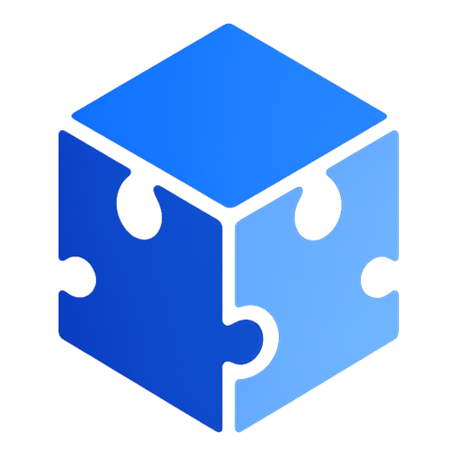
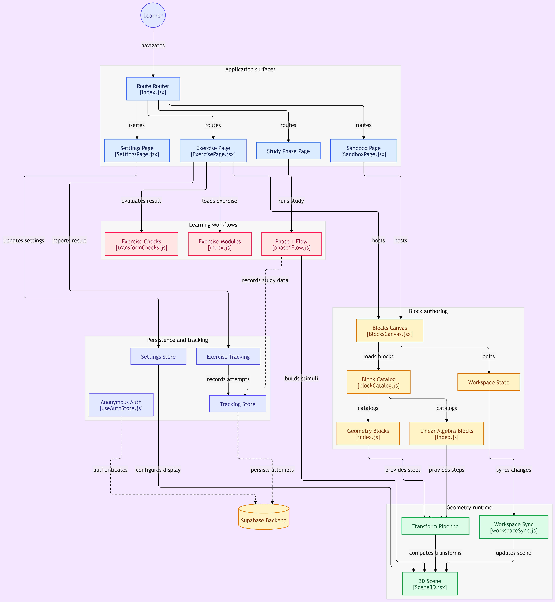
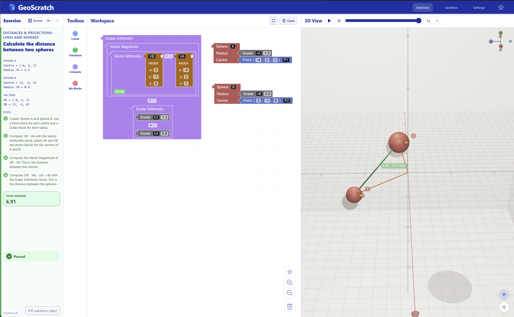

<div align="center">



# GeoScratch: Snap blocks together. See it in 3D.

<hr />

[](https://react.dev)
[](https://vite.dev)
[](https://threejs.org)
[](https://r3f.docs.pmnd.rs)
[](https://developers.google.com/blockly)
<br />
[](https://zustand.docs.pmnd.rs)
[](https://tailwindcss.com)
[](https://vitest.dev)
[](https://pnpm.io)

</div>

## Overview

GeoScratch is a block-based visual programming tool for learning 3D geometry and linear algebra. It pairs Blockly's drag-and-drop editor with a Three.js scene, so snapping together concept blocks (vectors, lines, planes, transforms, distances, solids) builds a live 3D picture of the maths.

Each block maps to one concept. Learners build scenes by combining blocks instead of writing formulas, and every edit to the workspace redraws the scene immediately.

## Features

- **Block editor**: vectors, lines, planes, points, solids, transforms, distance and projection blocks, plus named variables and reusable "My Blocks".
- **Live 3D scene**: orbitable view with labelled objects, haloed lines for depth, zoom-invariant glyphs, and two-way selection between a block and the object it draws.
- **Animated transforms**: play, pause and scrub through a transform pipeline step by step from the transport bar.
- **Guided exercises**: graded exercises grouped into units and sections, with per-device progress tracking.
- **Sandbox**: a free workspace for building any scene.
- **Settings**: light/dark theme, colour presets, labels and naming, highlight styles.

## Exercises

| Unit                    | Sections                                |
| ----------------------- | --------------------------------------- |
| Transformations         | Single transforms, Combining transforms |
| Distances & Projections | Points and planes, Lines and spheres    |
| Perception              | Depth cues                              |

Exercises cover translating, rotating and scaling objects, rotating about a pivot, threading lines through objects, point-to-plane and skew-line distances, sphere distances, and depth perception questions.

## Pages

| Route                   | What                                                |
| ----------------------- | --------------------------------------------------- |
| `/landing`              | Entry page                                          |
| `/exercises`            | Browse units and exercises                          |
| `/exercises/:unitId`    | A unit's sections, exercises and progress           |
| `/exercise/:exerciseId` | A guided, graded exercise                           |
| `/sandbox`              | Free-form workspace                                 |
| `/settings`             | Display, theme and naming preferences               |
| `/study`                | User study session (surveys, tasks, Phase 1 trials) |

## Getting started

This project uses **pnpm**. A `preinstall` check makes `npm install` fail.

```bash
git clone https://github.com/liqinshen9/GeoScratch.git
cd GeoScratch
pnpm install
pnpm dev
```

A local build runs on its own with no accounts or setup. You will notice two things, both visible in the screenshot below:

- **tracking off** badge (bottom-left): exercise attempts are not logged anywhere. Solved exercises are still remembered in the browser.
- **Fill solution (dev)** button: under `pnpm dev`, each exercise has a button that loads its worked solution into the workspace. It is compiled out of production builds.

### Scripts

```bash
pnpm dev           # dev server
pnpm build         # production build (catches import errors the others miss)
pnpm preview       # preview the production build
pnpm lint          # eslint
pnpm format        # prettier --write .
pnpm test          # vitest, single run
pnpm test:watch    # vitest in watch mode
```

## How it works



Every workspace edit rebuilds the whole scene:

```
Blockly workspace
  -> javascriptGenerator.workspaceToCode()   generated JS, as a string
  -> new Function(...runtimeArgs, code)      utils/generateAndRun.js
  -> window.threeObjStore                    blockId -> Object3D
  -> BlockRegistry.reconcile()               utils/runAndSync.js
  -> Scene3D                                 components/Scene3D/
```

Block builder functions are serialised with `.toString()` and evaluated inside the generated program, so they cannot use `import`s. They reach Three.js and app state through the runtime surface installed by `utils/sceneRuntime.js`. See [generated-code-runtime.md](docs/architecture/generated-code-runtime.md).

### Project layout

| Path                           | What                                                        |
| ------------------------------ | ----------------------------------------------------------- |
| `src/components/BlocksCanvas/` | Blockly host, block definitions and the block palette       |
| `src/components/Scene3D/`      | React Three Fiber canvas, labels, glyph sizing, animation   |
| `src/exercises/`               | One module per exercise (checker and panels)                |
| `src/store/`                   | Zustand stores plus colour, naming and animation config     |
| `src/utils/`                   | Pure logic and the generated-code runtime (most tests here) |
| `src/study/`                   | User study session and Phase 1 trial runner                 |
| `src/data/exercises.js`        | Exercise and unit metadata                                  |
| `docs/architecture/`           | Long-form subsystem docs                                    |

## In action



The "distance between two spheres" exercise: the steps and answer on the left, the blocks in the workspace, and the live 3D scene they build on the right. Blocks encode vector operations, line and plane forms, transforms and solids, each mapping one-to-one to a concept.

## Documentation

- [Architecture index](docs/architecture/README.md): rendering, halos, labels, collision, selection, animation, theming, naming and study flow.
- [CLAUDE.md](CLAUDE.md): contributor quick reference, including how to add a block or an exercise.
